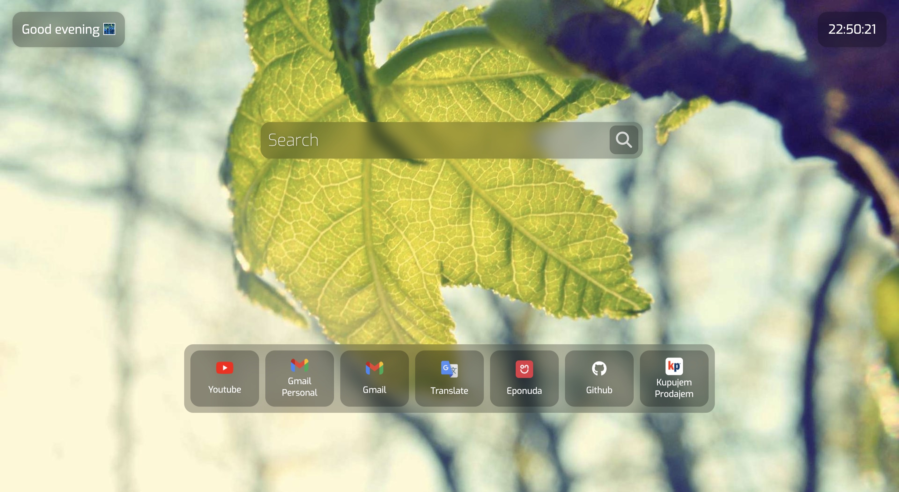

# Start Page
The Start Page is a project that is supposed to replace your default start/home page in the browser with a modern and minimalistic one. The one when you open your browser or when you open a new tab inside of it.

## How does it work?
1. The background image is always taken from [Picsum](https://picsum.photos/) a website that gives you placeholder (Lorem Ipsum) images.
2. The time in the top right corner is done with JavaScript which takes the system time and updates it every 1000 miliseconds (1 second).
3. The message in the top left corner is also done over JavaScript and it checks the value of hours from the time and gives the approperiate message depending on the value.
4. The search works by checking if you have a dot (.) inside of the search query and if you don't it just gives you a Google search of that. If you have a dot, then it takes you directly to the website you've given it. You do not need to add `http://` or `https://` since `https://` is added to the beginning of it automatically. If you press the search button, it will always search it on Google.
5. Favorites are on the bottom and they are static and they cannot be edited outside from the code *(yet)*. The only way you could do that is in the **How to edit favorites?** section below.

## How to set it as a start page or new tab?

### Microsoft Edge
1. Click on 3 dots (...) on the top right corner
2. Click on **Settings**
3. In the search on the left type **open these pages**
4. Select it and click on **Add a New Page**
5. Paste in this link `https://sluki03.github.io/start-page/` and click **Add**

*It can only be setup as a start page when the browser is opened.*

### Brave
1. Click on 3 horizontal lines on the top right corner
2. Click on **Settings**
3. Under **Settings** click on **🚀 Get started**
4. Under **startup click on **Open a specific page or set of pages**
5. Click on **Add a new page**
6. Paste in this link `https://sluki03.github.io/start-page/` and click **Add**

*It can only be setup as a start page when the browser is opened.*

### Google Chrome
1. Click on 3 dots on the top right corner
2. Click on **Settings**
3. On the left click on **On startup**
4. Click on **Open a specific page or set of pages**
5. Click on **Add a new page**
6. Paste in this link `https://sluki03.github.io/start-page/` and click **Add**

*It can only be setup as a start page when the browser is opened.*

## How to edit favorites?
1. Download the whole project and open it in the code/text editor.
2. Add the images of the websites you want to add in the **images** folder.
3. In **index.html** edit existing or copy-paste the already existing ones and change the **src** attribute in the **img** tag ``.
4. You can change the name of the website link in the paragraph tag between **><** in `

`.
5. Set the local **index.html** as the start page/new tab.

  

[Website link](https://sluki03.github.io/start-page/)

If you want to stay updated make sure to **Watch** the project and **Star** it if you like it, thank you. 